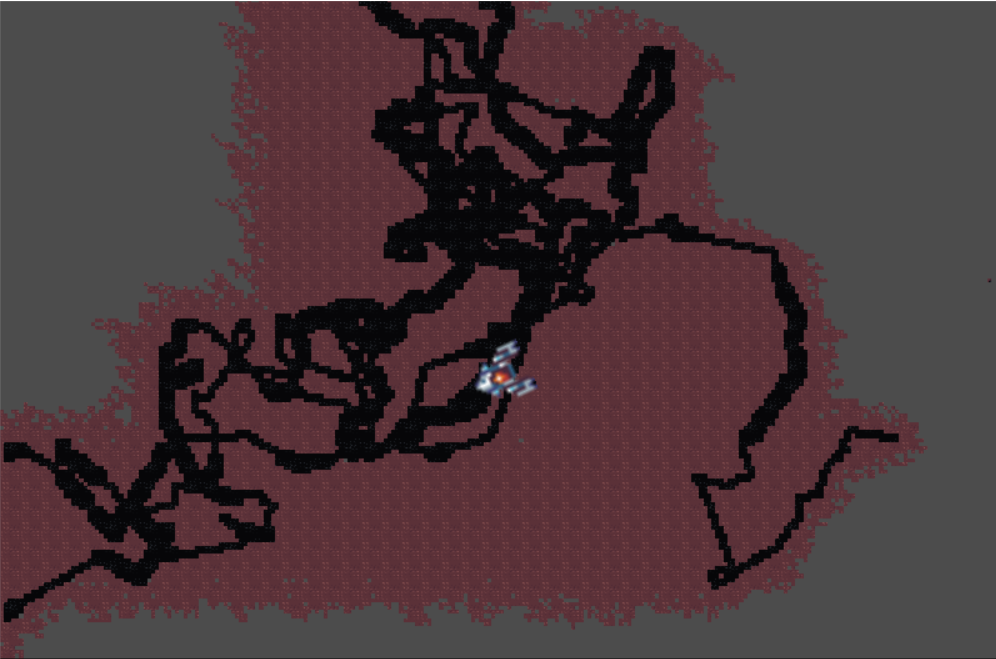

I added the Asteroid generation code. There is no collision with the tiles vs ship yet. I need to add code for getting the right tiles and ores and stuff. Also the enemy turrets.

I had lots of difficulties figuring out how to set the tiles. I (re)discovered the Vector2 settings were 1,1 instead of 16x16 on the atlas.
A note is that I need to figure out if I can change the atlas image and the collision data does not get nuked.

The wasm file included in this directory is from the old version. I think I need to remove this or recompile it for every new version.

In the tilemap settings you can set the scale of the tiles. I set it to .1 and .1 for the screenshot. In the game itself it would be 4 and 4. The atlas has tiles with the size of 16x and 16y.

